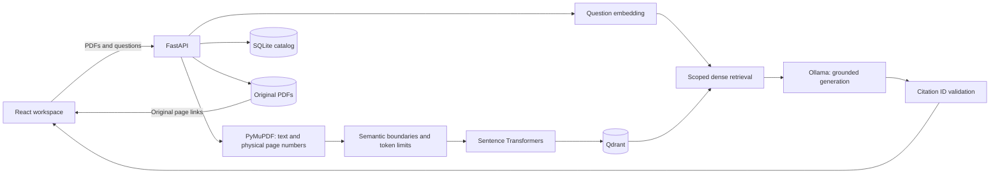

# Multimodal Knowledge Engine

**Turn a library of PDFs into searchable, source-grounded knowledge.**

A local-first RAG application built with FastAPI, PyMuPDF, Sentence Transformers, Qdrant, and React. Upload multiple PDFs, ask questions across your library or selected sources, inspect the retrieved evidence, and open citations at the original PDF page.

**Milestone 1:** text-based PDFs. OCR, images, audio, and video are extension points, not implemented features.

## What works

- Multi-PDF uploads with individual success/error results, duplicate detection by file content, file/page limits, and clear scanned-PDF warnings.
- Page-aware extraction and semantic chunking using adjacent sentence embedding similarity and a tokenizer-based size limit.
- Local normalized embeddings with `sentence-transformers/all-MiniLM-L6-v2` and persistent Qdrant storage.
- A persistent SQLite document catalog, source selection, document deletion, and PDF viewing.
- Retrieval-augmented answer generation through Ollama, with validated citation IDs and page-level evidence links.
- Explicit extractive mode for using retrieval without a generative model; failures never silently switch modes.
- Responsive React/TypeScript interface, Docker Compose, VS Code debug configuration, automated backend tests, and GitHub Actions.

## Architecture



**Ingestion:** validate → extract each page → split into sentences → embed sentences → split at topic changes or token budget → embed chunks → persist points and PDF → mark catalog record ready. A chunk never spans pages. Long sentences are split by tokenizer tokens. Empty pages retain their original position, so citations stay correct.

**Question answering:** embed the question → filter to ready, selected documents → retrieve the top matching chunks over a configurable similarity threshold → send excerpts to Ollama as untrusted context → validate cited IDs → return answer plus evidence. Questions are independent; the visible conversation history is not sent to the model.

## Quick start: Docker

Install Docker with Compose. Allow several GB of disk space for Python/PyTorch images and models. First startup downloads the embedding model; CPU inference is supported and may be slow.

From the project root:

```sh
docker compose up --build -d
docker compose exec ollama ollama pull llama3.2:3b
docker compose logs -f backend
```

Open **http://localhost:3000**. The frontend waits for the backend health check. Wait for the Ollama model pull to finish before asking questions. The first cold startup may take several minutes; if the model download exceeds the health-check window, run `docker compose up -d` again after the backend finishes starting.

- API documentation: http://localhost:8000/docs
- Qdrant dashboard: http://localhost:6333/dashboard
- Stop: `docker compose down` (named volumes preserve data).
- `docker compose down -v` **permanently deletes** stored PDFs, vectors, and downloaded models.

Compose runs Ollama on CPU by default. GPU configuration depends on your host. Host ports bind to loopback. Compose uses its own settings, so editing `backend/.env` does not change container configuration; edit `docker-compose.yml` or use a Compose override.

## Local development: VS Code

Recommended: Python 3.11 or 3.12, Node.js 22, and Ollama. Open **this project directory** in VS Code. No Qdrant server is required: an empty `QDRANT_URL` uses embedded, persistent Qdrant.

### 1. Backend

PowerShell:

```powershell
cd backend
py -3.11 -m venv .venv
.venv\Scripts\python -m pip install -r requirements-dev.txt
Copy-Item .env.example .env
.venv\Scripts\python -m uvicorn app.main:app --reload
```

macOS/Linux:

```sh
cd backend
python3.11 -m venv .venv
.venv/bin/python -m pip install -r requirements-dev.txt
cp .env.example .env
.venv/bin/python -m uvicorn app.main:app --reload
```

Run the backend from `backend/` so `.env` and relative data paths resolve correctly. Select the backend virtual environment in VS Code before using the supplied debugger. Use **one worker** for this milestone, including when using server Qdrant; ingestion locking and recovery are designed for one application process.

### 2. Local language model

In a separate terminal, start Ollama if its desktop service is not already running:

```sh
ollama serve
```

In another terminal:

```sh
ollama pull llama3.2:3b
```

To run retrieval without Ollama, set `GENERATION_MODE=extractive` in `backend/.env` and restart the backend. This returns verbatim retrieved passages labeled as excerpts, not synthesized answers.

### 3. Frontend

```sh
cd frontend
npm ci
npm run dev
```

Open **http://localhost:5173**. Vite proxies `/api` to port 8000. The production Nginx configuration performs the same routing inside Compose. `npm run preview` serves the build with Vite's local proxy; use Compose to exercise the production Nginx configuration.

### 4. Try the flow

1. Upload two text-based PDFs. Wait until they appear in the source list.
2. Ask a specific question whose answer appears in one of the PDFs.
3. Click an `S1` citation to inspect the excerpt and open its PDF page.
4. Select a source checkbox and repeat the question to restrict retrieval.
5. Upload the same file again: it should be reported as already indexed.

No sample documents or fabricated answers are preloaded. Page links refer to **one-based physical PDF pages**, which may differ from printed page labels.

## Project layout

```text
backend/
  app/
    main.py          HTTP API and lifecycle
    config.py        Environment settings
    extraction.py    PDF adapter and page metadata
    chunking.py      Semantic boundary detection
    embeddings.py    Model adapter
    storage.py       SQLite catalog and Qdrant repository
    generation.py    Ollama adapter and citation validation
    service.py       Ingestion/retrieval orchestration
  tests/             Real PDF/Qdrant tests with deterministic model doubles
  requirements.txt
  requirements-dev.txt
  .env.example
frontend/
  src/main.tsx       Workspace, upload, chat, evidence viewer
  src/style.css     Responsive styling
  nginx.conf        Production API proxy
docs/
  DESIGN.md         Data model, limitations, extension plan
.github/workflows/ci.yml
.vscode/
docker-compose.yml
```

## Configuration

See `backend/.env.example` for all settings.

| Setting | Default | Purpose |
|---|---|---|
| `DATA_DIR` | `data` | Catalog, originals, embedded Qdrant |
| `QDRANT_URL` | empty | Empty = embedded; otherwise a Qdrant server URL |
| `QDRANT_API_KEY` | empty | Optional Qdrant server credential |
| `QDRANT_COLLECTION` | `knowledge_minilm_v1` | Vector collection namespace |
| `EMBEDDING_MODEL` | `sentence-transformers/all-MiniLM-L6-v2` | Local embedding model |
| `GENERATION_MODE` | `ollama` | `ollama` or explicit `extractive` |
| `OLLAMA_URL` | `http://localhost:11434` | Ollama endpoint |
| `OLLAMA_MODEL` | `llama3.2:3b` | Installed generation model |
| `CHUNK_TOKENS` | `220` | Maximum tokens per chunk, below default model context |
| `SEMANTIC_THRESHOLD` | `0.45` | Split when adjacent sentence cosine similarity falls below this |
| `RETRIEVAL_THRESHOLD` | `0.25` | Minimum chunk similarity; tune with your own evaluation set |
| `MAX_FILE_MB` / `MAX_FILES` / `MAX_PAGES` | `25` / `10` / `500` | Per-file, per-request, and page limits |

Similarity thresholds are heuristics, not calibrated confidence scores. The UI uses the default file limits; update the client validation if you change server limits.

**Changing index configuration:** the saved index manifest rejects changes to the embedding model, chunk settings, collection, or Qdrant endpoint. Use a new `DATA_DIR` and `QDRANT_COLLECTION`, then upload documents again. Never mix embeddings from different models, even if vector dimensions match. Keep the default chunk limit below the context window of any replacement model.

## API

| Method | Route | Behavior |
|---|---|---|
| GET | `/api/health` | Backend/model initialization status and configured mode |
| GET | `/api/documents` | Ready documents |
| POST | `/api/documents` | Multipart `files`, repeated for multiple PDFs |
| GET | `/api/documents/{id}/file` | Original PDF, suitable for `#page=N` links |
| DELETE | `/api/documents/{id}` | Remove vectors, original, and catalog entry |
| POST | `/api/chat` | Scoped question answering |

Example request:

```json
{"question":"What are the main findings?","document_ids":[],"top_k":5}
```

An empty `document_ids` array searches all ready documents. Unknown IDs fail explicitly. A chat response contains `answer`, `mode`, and `sources`; each source includes its ID, original filename, physical page, excerpt, similarity score, and PDF URL. `mode=no_evidence` denotes empty/insufficient retrieval. Ollama outages and invalid citation IDs return 502 without fabricating an answer.

Multi-upload returns HTTP 200 with one `ok` result per file; clients must inspect individual results. Excess batch size returns 400, and invalid request fields return 422.

## Validation

From `backend/`, using your virtual environment:

```sh
python -m pytest -q
python -m ruff check .
```

From `frontend/`:

```sh
npm ci
npm run build
```

Backend tests exercise real PyMuPDF parsing and embedded Qdrant persistence, plus model doubles for repeatable, offline tests. They cover page numbering, semantic boundaries, token limits, duplicate ingestion, source scope, deletion, rollback, restart recovery, uploads/downloads, low-evidence handling, citation validation, and generation outages. These tests do **not** establish real-model answer quality. See `docs/VALIDATION.md` for checks performed on this delivery.

Optional real embedding integration check, from `backend/`: `python scripts/smoke_test.py`. It downloads MiniLM if needed, creates a temporary two-page PDF, indexes it in embedded Qdrant, and asserts that the wind-energy question cites page 2. It does not require Ollama or alter your application data.

Dependencies use bounded compatible ranges. `package-lock.json` locks the frontend dependency tree. For a deployment, create a Python lock file for your target platform and review model/image versions and licenses. PyMuPDF is distributed under AGPL/commercial licensing; assess the appropriate license before distribution.

## Scope and next milestones

This is a single-user development application, not a public multi-tenant service. It has no login or user authorization. PDF parsing, embedding, and generation are synchronous tasks executed through FastAPI's worker thread pool, with serialized ingestion. Keep it on localhost until deployment hardening is added.

- **M2 — richer ingestion:** OCR adapter, layout-aware extraction, image descriptions, and page regions.
- **M3 — audio/video:** transcription, key frames, timestamp-based evidence, and background jobs.
- **M4 — retrieval quality:** sparse+dense hybrid retrieval, reranking, evaluation datasets, and retrieval analytics.
- **M5 — deployment:** authentication, workspace isolation, task queues, storage abstraction, monitoring, resource quotas, and backups.

See [design and extension plan](docs/DESIGN.md) for the concrete seams.

## Technical references

- [FastAPI uploads](https://fastapi.tiangolo.com/tutorial/request-files/)
- [PyMuPDF text extraction](https://pymupdf.readthedocs.io/en/latest/recipes-text.html)
- [Sentence Transformers embeddings](https://www.sbert.net/examples/sentence_transformer/applications/computing-embeddings/README.html)
- [Qdrant Python client](https://github.com/qdrant/qdrant-client)
- [Ollama API](https://github.com/ollama/ollama/blob/main/docs/api.md)
